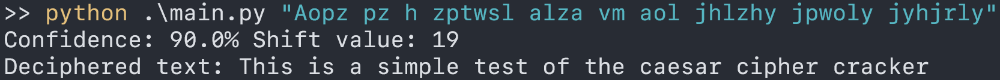

# Py Brute Caesar

## About

This a very simple Python 3 script to brute force Caesar ciphered text. It was written in a couple of hours for fun and is not efficient whatsoever, especially if the ciphertext is more than a few short sentences. This is also built for English text only, and any other language would likely need heavy reworks or refactoring to get working. 



## Requirements

- Python 3 (3.10.5 used for development)
- A plain txt english dictionary file. [This is the file I used for testing.](https://raw.githubusercontent.com/dwyl/english-words/master/words.txt)

## How to use

First you will need to place your dictionary file in the same directory as the python file and rename it to ```words.txt```. 

You then just need to run ```python main.py "[ciphertext]"``` to run the script and wait for it to brute force shift values and match words. This may take a long time if the text is not relatively short.
